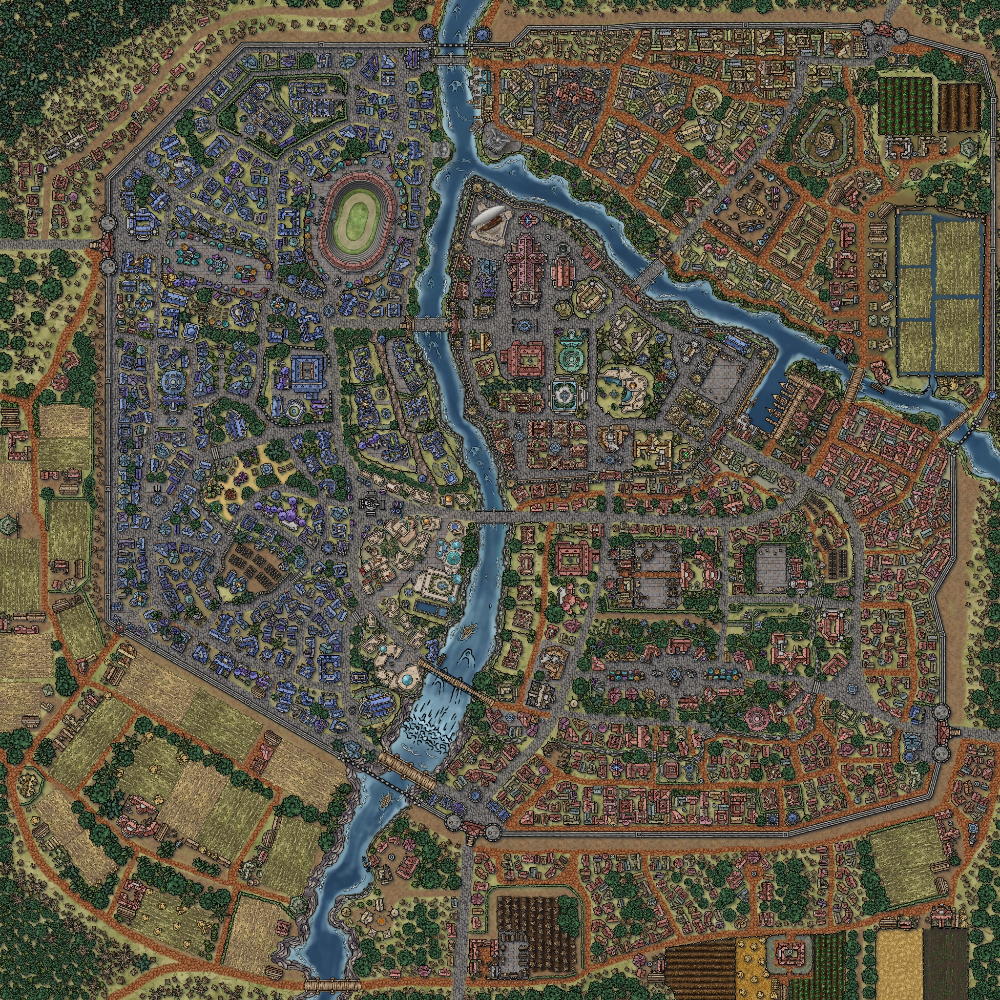
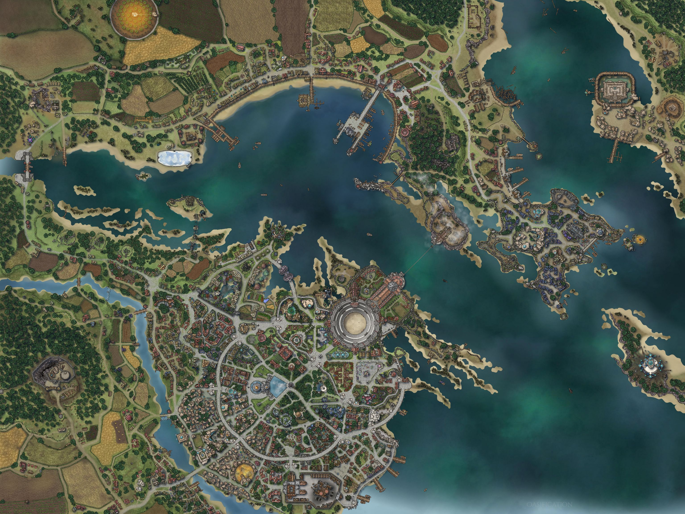
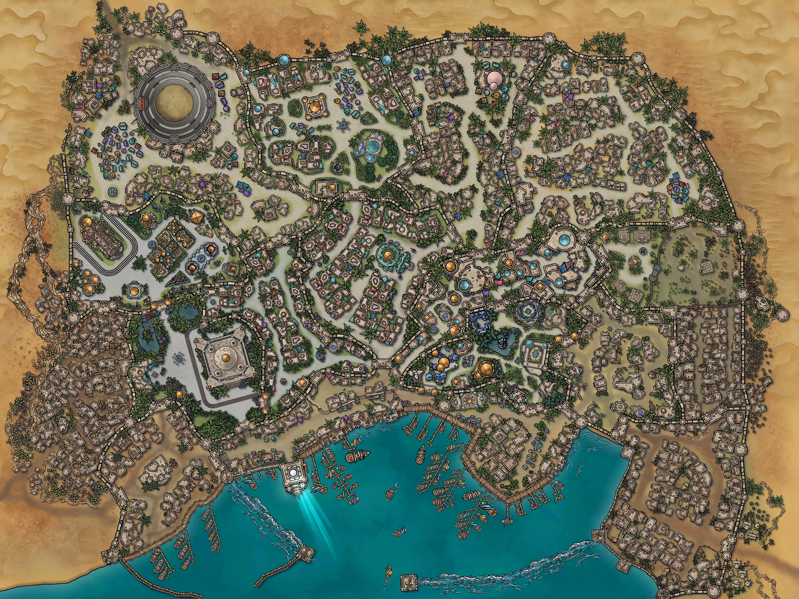

# City Information Breakdown

## Major Cities

Griffinbrook

# Griffinbrook

_Quick Glance_

> Population: ~76,000  
> Home of **Lord Ashcroft**, ruler of Eirial  
> Home of Eirial's Military  
> Religiously diverse  
> Racially diverse  
> Home to all major guilds

## Social

Griffinbrook is home to many a race and creature. Gnomes, Elves, Humans, Orcs, Firbolgs, Kenku, etc. They all make their home in Griffinbrook. There is a power dynamic based on wealth within the city howeever. Society is informally split into castes. Day laborers, farmers, etc. all are considered of the lowest rung. Many business men, merchants, and a few researchers sit within the middle class. The military, the Ashcroft family, and the higher ranking clergy of the churches of Otaris and Lorein all fill the upper levels of the caste.

## Political

The inner walls are controlled by Lord Ashcroft and the guard of General Raddock. Lord Ashcroft's ascension to the throne came at a young age, after his father's assassination. The Ashcroft family, and some citizens of Griffinbrook believe that the Ashcroft family is destined to rule, by the grace of the gods. The inner walls of Griffinbrook seem to either believe this, or go along with it to remain out of trouble. Outside the walls however, the lower castes and common workers feel out of touch with the ruling elite, and long for a change in leadership.

## Economic

The primary source of income for Griffinbrook are the taxes that it collects from all of the surrounding cities, towns, and villages. In return, they're offered protection for threats from the outer islands, the north, or even internal issues. Secondary to taxation, Griffinbrook's farmland produces a great deal of grain for the area, making it home to many farmers and brewmasters. The "Ashcroft Ale" is a particularly hearty commodity sought after even in the far reaches beyond Zorian's spine.

## Religious

Griffinbrook is a diverse city. Almost all gods are repsented in some capacity. With the sprawling farmlands around it, Relene sees plenty of praise. To the north lie the Mountains of Moranth, naturally aiding in his recognition within the city. Lord Ashcroft has a personal soft spot for Otaris and Lorein, which in turn means that many of his citizens follow in his footsteps. Temples to Otaris and Lorein are plentiful and small shrines can be found even in some taverns and shops.

## Military

Griffinbrook is home to the primary military force for the realms of Eirial, entitled The Kings Guard. The military accounts for almost 10% of the entire population of Griffinbrook. The military is currently led by General Raddock. Raddock, while gaining in age - is still an intimidating presence, and demands respect.

There is a subset of the military that acts as an "elite force". While the composition and mission of this force is unknown to the general populus, they have been given the nickname "The Red Riders". The Red Riders fall outside the normal scope of military influence, and seem to only take official orders from General Raddock or Lord Ashcroft himself.

## View on Magic

Griffinbrook is no stranger to magic. Many mages are employed by the Ashcroft family to research and provide services for the elite. However, the lower castes are expected to maintain a distance from the practice of magic. Much of it is a gap in knowledge, and a need for control. Those who wish to perform magic within the city must present themselves to the Guard for inspection, designation, and branding. Mages outside of the societal elite typically find themselves branded along the neck or face and, depending on the level of their ability, may have to submit themselves to a "dampening" device of unknown origin, to better control their power.

Midthorn

# Midthorn

_Quick Glance_

> Population: ~43,000
> Current home of the Thorn Guard
> Primarily Humans, Elves, Halflings, and Dwarves
> Rampant crime due to lack of structured power

### Social

Midthorn is more "open" than most other major cities. If you've got the motivation or the money to make something happen - you can make it happen in Midthorn. There's no clear division as to a ruling class and commoners. The only group that stands out from the rest is the Thorn Guard.

### Political

The city is primarily run by The Thorn Guard, a militia uprising opposing Lord Ashcroft's rule. All of the established King's Guard who were stationed in Midthorn were either kicked out, publically executed, or in hiding amongst the city. The Thorn Guard are in opposition to the Ashcroft's family's sense of divine rule and their harst punishment of magic users. Their goals are rather public, usurp the throne and implement a member of the Thorn Guard. Their methods however are, as of yet, unknown.

### Economic

Trade relations are strained with Midthorn at the moment. Lord Ashcroft has called for a trade embargo, in hopes to starve out the Thorn Guard. While common goods may not ship and and out of Midthorn often, they have become a hub for illegal trade goods. This money, while illegitimate, puts them in step with the capital. Items and services of almost any kind can be found here. Two of the largest draws are something called "The Challenge Arena", and ship captains claiming to know how to access the Floating City. Neither have been verified.

### Religious

Lucience and Balth both hold a special place in the hearts of Midthorn citizens. Many who sail the sea search for fortune, fame, and luck. Those amongst the Thorn Guard pray to Balth to grant them special leeway in any impedning battles with Griffinbrook. There have been others popping up however. The one that's beginning to concern people is the random appearance to altars of Gorth. Their devotees haven't made public their intent, but the citizens concern grows daily.

### Military

The Thorn Guard have taken control of the City. A younger, elven, guard captain by the name of Raymond Vereen sits at the helm. There is no official Governor of Midthorn anymore, he was removed with the rest of the Ashcroft sympathizers. The Thorn Guard's numbers are unknown, but within the city their presence is well known. The Guard use the prisons and fighting pits now for entertainment of torture of those still loyal to Ashcroft. Most "normal" offenses are handled by the people. Their justice often swift and precise, though unmeasured.

### View on Magic

Midthorn appreaches magic with a bit more intrigue, rather than disgust or fear. Many still don't understand it's place in the world, but are coming to understand that it makes day to day life easier in some aspects. While out of the reach for many normal citizens of Midthorn, service merchants have cropped up offering services from the most mundance to the extraordinary. Unless a magical act is seen as a threat to the Thorn Guard, it is often permitted.

Clovernook

# Clovernook

_Quick Glance_

> Population: ~56,000  
> Home of **Lord Ashcroft**, ruler of Eirial  
> Home of Eirial's Military
> Religiously diverse  
> Home to all major guilds

### Social

### Political

### Economic

### Religious

### Military

Crystalbreak

# Crystalbreak

_Quick Glance_

> Population: ~39,000

### Social

### Political

### Economic

### Religious

### Military

Elderberg

# Elderberg

_Quick Glance_

> Population: ~56,000  
> Home of **Lord Ashcroft**, ruler of Eirial  
> Home of Eirial's Military
> Religiously diverse  
> Home to all major guilds

### Social

### Political

### Economic

### Religious

### Military

Guanoglen

# Guanoglen

_Quick Glance_

> Population: ~56,000  
> Home of **Lord Ashcroft**, ruler of Eirial  
> Home of Eirial's Military
> Religiously diverse  
> Home to all major guilds

### Social

### Political

### Economic

### Religious

### Military

Dracorise

# Dracorise

_Quick Glance_

> Population: ~56,000  
> Home of **Lord Ashcroft**, ruler of Eirial  
> Home of Eirial's Military
> Religiously diverse  
> Home to all major guilds

### Social

### Political

### Economic

### Religious

### Military

Floating City

# Floating City

_Quick Glance_

> Population: ~56,000  
> Home of **Lord Ashcroft**, ruler of Eirial  
> Home of Eirial's Military
> Religiously diverse  
> Home to all major guilds

### Social

### Political

### Economic

### Religious

### Military

## Minor Cities

Expand

Expand

Expand

